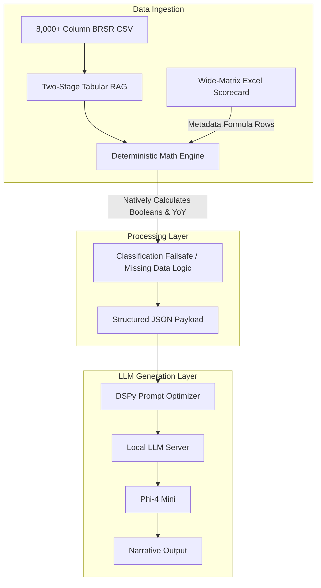

# NSRAL: Deterministic ESG Automation Pipeline

NSRAL (Narrative Synthesizer for Regulatory & Analytical Logic) is a robust, highly-deterministic data extraction and natural language pipeline. It is designed to safely parse massive regulatory datasets (like 8,000+ column BRSR CSVs) against proprietary, wide-matrix Excel scorecards without relying on Large Language Models for arithmetic.

By offloading the mathematical lifting to a deterministic Pandas engine and relying on a Small Language Model (SLM) solely for narrative generation, this architecture completely eliminates numeric hallucination.

## System Architecture

The pipeline leverages a "Metadata Formula Row" injected directly into the proprietary scorecard. This allows the system to seamlessly calculate Booleans, conditionals, and Year-over-Year variance dynamically.

## Directory Structure

The repository is built around a secure `data/` structure (ignored by Git to protect proprietary records) and a modular `scripts/` folder that executes the pipeline.

### Core Architecture Scripts (`/scripts`)

#### 1. Data Ingestion & RAG
- **`embed_columns.py`**: Executes the first stage of the Tabular RAG. Generates high-density vector embeddings (using SentenceTransformers) for all 8,000+ BRSR column headers to allow for semantic matching.
- **`semantic_cross_verify.py`**: A cross-verification utility that maps proprietary scorecard questions against the BRSR embeddings. Generates heatmaps and match scores to validate alignment.

#### 2. The Deterministic Math Engine
- **`extract_brsr_metrics.py`**: The core extraction script. It iterates through the target companies, pulls raw numerical data from the BRSR CSV, and evaluates it.
- **`run_sdg_pipeline.py`**: The execution engine that parses the "Metadata Formula Row" from the Excel scorecard. It evaluates the string-based formulas natively in Pandas (including missing-data failsafes) and generates the populated scorecard.

#### 3. LLM Translation Layer
- **`generate_llm_reports.py`**: Ingests the perfectly calculated numerical facts and passes them to the local SLM to generate professional, institutional financial narratives.

#### 4. Synthetic Data Testing (SDG)
*Because the pipeline handles highly proprietary data, testing must be done synthetically.*
- **`generate_synthetic_data.py`**: Acts as "The Mocker." Uses an LLM to generate a synthetic Golden Dataset of fictional companies based strictly on the BRSR schema, purposefully injecting edge cases (missing data, zeroes, nulls).
- **`llm_as_a_judge.py`**: The decoupled evaluation script. Fires up an isolated LLM Judge to grade the pipeline's output against the ground-truth synthetic facts, ensuring zero hallucinations.

#### 5. Data Acquisition (Legacy/Utility)
- **`download_xbrl.py`**: Automates the scraping and downloading of raw XBRL filings.
- **`build_database.py` & `build_hierarchical_database.py`**: Utilities to organize the raw XBRL files into a structured directory for parsing.
- **`compile_brsr_csv.py`**: Parses the raw financial data into the master 8,000-column CSV format.
- **`parse_tree_chart.py`**: Parses organizational hierarchies from reference Excel charts.

## Setup & Execution

### 1. Requirements
Ensure you have Python installed along with the dependencies for Pandas, SentenceTransformers, and Requests.
The translation and testing layers require a local instance of [Ollama](https://ollama.com) running `phi4-mini:latest`.

### 2. Local Data Safety
The `.gitignore` strictly ignores the contents of the `/data` folder. You can safely place your raw CSVs, proprietary Excel scorecards, and parsed databases in their respective `data/raw/` or `data/reference/` folders without risking a public leak.

### 3. Pipeline Run
To test the architecture using Synthetic Data:
1. Generate the synthetic data: `python scripts/generate_synthetic_data.py`
2. Run the deterministic math engine: `python scripts/run_sdg_pipeline.py`
3. Audit the results: `python scripts/llm_as_a_judge.py`
